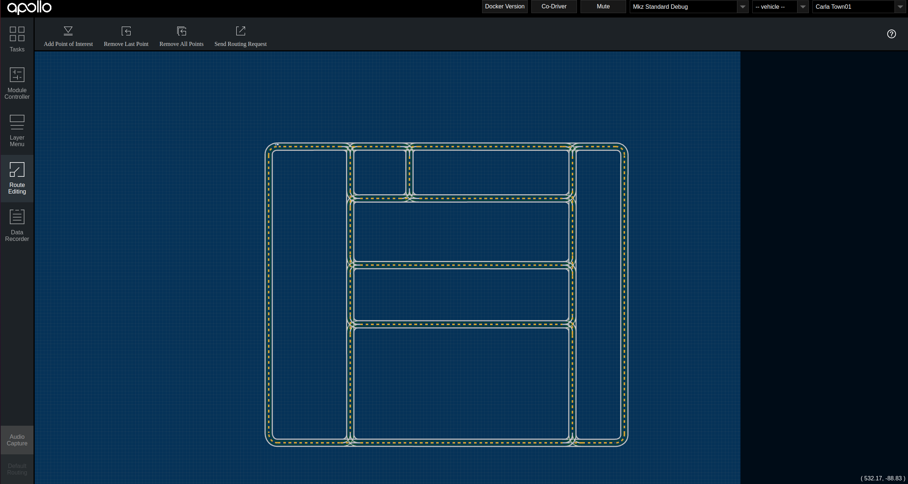
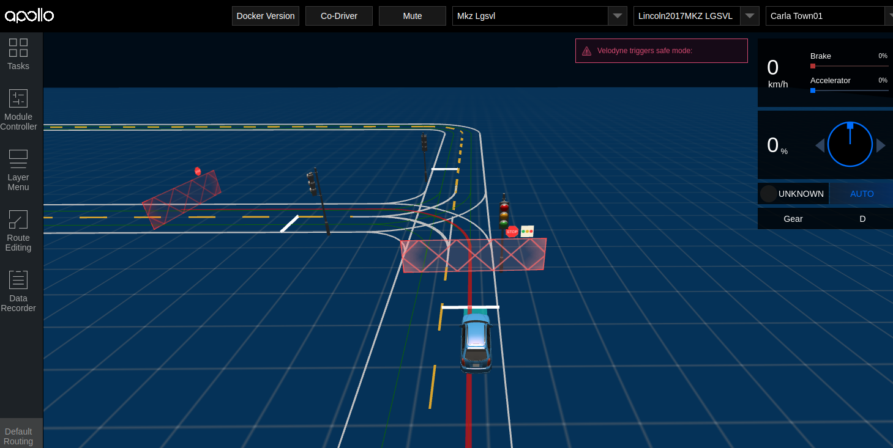
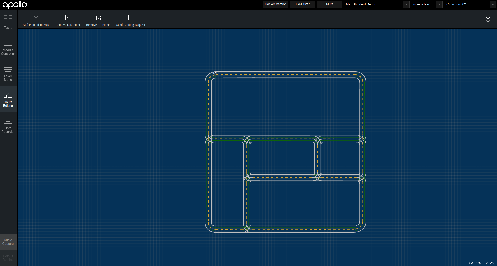
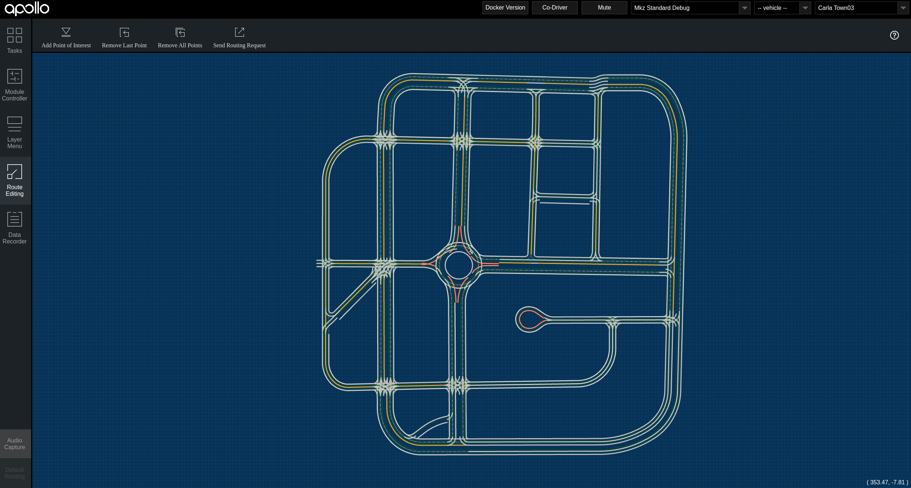
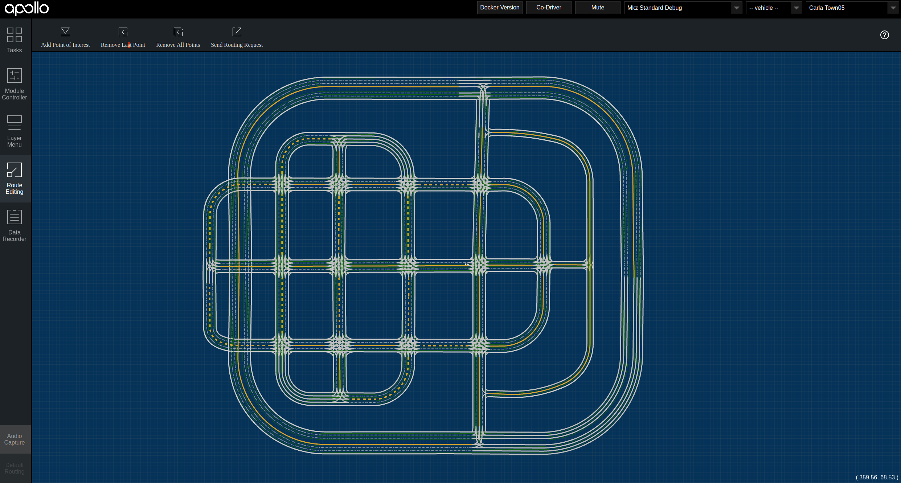

To add the maps to Apollo:
1. make a directory in apollo/modules/map/data by the name of the map.
2. copy to it base_map.xml .
3. generate routing_map file for each map. It can be generated by the command:

  ```
   dir_name=modules/map/data/town01 # example map directory
   ./scripts/generate_routing_topo_graph.sh --map_dir ${dir_name}
  ```
  
4. generate sim_map file for each map. It can be generated by the command: 

  ```
  dir_name=modules/map/data/town01 # example map directory
  bazel-bin/modules/map/tools/sim_map_generator --map_dir=${dir_name} --output_dir=${dir_name}
  ```
  
Note 1 : for carla\_town01 and carla\_town03 no need to generate extra files. You can find all the needed files in the map folder.

Note 2 : Town01 has all the traffic lights, added to test Apollo autonomous driving at intersections. 


## Map Carla Town01





## Map Carla Town02



## Map Carla Town03



## Map Carla Town04


## Map Carla Town05


